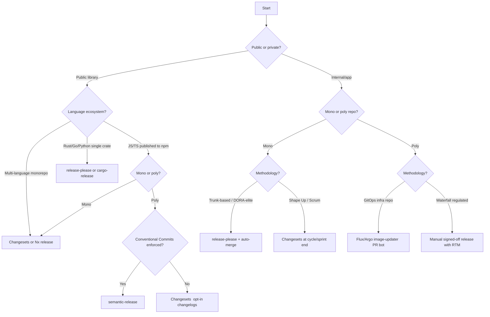
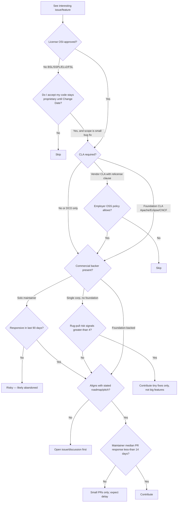

> **Consult this if:** matching repo practices to a development methodology, understanding license implications before contributing, detecting rug-pull risk, or choosing a release tool.
>
> **Cross-refs:** [01#release-automation](./01-repo-management.md#release-automation) · [02#cla-navigation](./02-contribution.md#cla-navigation) · [08#influence-ladder](./08-influence.md#influence-ladder)

## Table of Contents

- [Methodology and Repo Practices](#methodology-and-repo-practices)
- [Business License Models](#business-license-models)
- [Release Tool Decision](#release-tool-decision)
- [Contribution Decision Tree](#contribution-decision-tree)
- [CLA Types](#cla-types)
- [Rug-Pull Detection](#rug-pull-detection)
- [Top 12 Methodology Business Decision Rules](#top-12-methodology-business-decision-rules)

---

# Methodology & Business/License Models → Repo Management Decisions

**Purpose.** This layer sits on top of the structural research (branches, PRs, CI, community files) in files 01-04 and answers the question *"given what this project actually is, which pattern should the skill recommend?"* Every rule below is actionable — no theory for its own sake.

---

## Methodology and Repo Practices

### 1. Agile / Scrum

**Core idea.** Fixed-length sprints (typically 2 weeks), a backlog estimated in story points, ceremonies (planning, stand-up, review, retro) gate each increment.

**Repo signals.** Milestones named `Sprint 42` / `2026-04-Sprint-2`; labels like `story`, `epic`, `story-points:5`; issue templates with user-story form ("As a X I want Y"); PRs reference Jira/Linear tickets (`PROJ-1234`); release cadence tracks sprint end dates.

**Adaptations.**
- **Branching:** GitFlow-lite (`main` + `develop` + `feature/PROJ-1234-*`) or trunk-based with sprint tags. GitFlow's ceremony fits Scrum's ceremony.
- **PR size:** Small enough to fit in one sprint (≤400 lines as a rough ceiling).
- **Review cadence:** Daily during stand-up window; PRs should not age past sprint boundary.
- **Milestones:** 1 milestone per sprint, closed at sprint review. Carry-over issues move, don't duplicate.
- **Labels:** `priority:{p0..p3}`, `type:{story,bug,chore,spike}`, `points:{1,2,3,5,8,13}`.
- **Releases:** End-of-sprint tag (`v1.42.0`); release notes are the sprint review artifact.

### 2. Shape Up (Basecamp)

**Core idea.** 6-week "cycles" interrupted by 2-week cool-downs; work is **shaped** (rough-solution pitches) before a small group **bets** on what ships; circuit-breaker: unfinished work at week-6 is **killed, not extended** ([Basecamp Shape Up](https://basecamp.com/shapeup/0.3-chapter-01)).

**Repo signals.** Issues tagged `pitch`, `bet`, `cool-down`; milestones named `Cycle 7` (not sprint N); no story points; hill-chart references in comments; a `/pitches/` directory of markdown write-ups; very long-lived feature branches per bet (up to 6 weeks).

**Adaptations.**
- **Branching:** One long-lived `cycle/<bet-name>` branch per bet, merged to `main` at cycle end. Feature-flags optional since each bet is a cohesive unit.
- **PR size:** Big, integrated PRs at cycle end — **reviewers should expect this**, not fight it. Interim "scout" PRs for risk reduction.
- **Review cadence:** Hill-chart check-ins, not daily PR triage.
- **Milestones:** 1 milestone = 1 cycle. Append `[SCOPE HAMMERED]` label when scope is cut mid-cycle ("variable scope, fixed time").
- **Labels:** `shaped`, `unshaped`, `uphill`, `downhill`, `scope-hammer`, `appetite:small|big`.
- **Releases:** 1 release at end of cycle ([Shape Up betting table](https://basecamp.com/shapeup/2.2-chapter-08)).

### 3. Trunk-based development

**Core idea.** All devs commit to `main` or very short-lived branches (<2 days); feature flags decouple deploy from release; release trains cut tags on a cadence ([trunkbaseddevelopment.com](https://trunkbaseddevelopment.com/short-lived-feature-branches/)).

**Repo signals.** `main` receives 10+ merges/day; no `develop` branch; LaunchDarkly/Unleash/Flagsmith config files; CODEOWNERS strict; `release/<date>` tags cut weekly or daily; feature-flag cleanup issues.

**Adaptations.**
- **Branching:** `main` + ephemeral `feat/*`. No long-lived release branches except for LTS.
- **PR size:** Tiny (≤200 LoC ideal). Multiple merges per developer per day.
- **Review cadence:** Near-synchronous (<4h). Async review kills trunk-based flow.
- **Milestones:** Calendar-based, not feature-based (`2026-W17-release`).
- **Labels:** `flag:<name>`, `flag-cleanup`, `release-blocker`.
- **Releases:** Continuous or daily release trains; version tags from `main` HEAD ([Atlassian TBD guide](https://www.atlassian.com/continuous-delivery/continuous-integration/trunk-based-development)).
- **Must-have:** Feature-flag hygiene — every flag PR creates a paired cleanup issue with a due date.

### 4. Extreme Programming (XP)

**Core idea.** Pair/mob programming, TDD-first, small releases (1-2 weeks), continuous integration, collective code ownership ([Wikipedia XP](https://en.wikipedia.org/wiki/Extreme_programming)).

**Repo signals.** Commit trailers `Co-Authored-By:` on nearly every commit; tests land before or with implementation (never after); CODEOWNERS wide-open or absent; CI blocks merge on coverage regression; `spike/*` branches for time-boxed exploration.

**Adaptations.**
- **Branching:** Trunk-based; pair commits directly to `main` when green.
- **PR size:** Small by construction (each red-green-refactor cycle).
- **Review cadence:** Real-time (pairing *is* review). PR review is a sanity check, not a gate.
- **Milestones:** Short iterations (1 week). Release = iteration boundary.
- **Labels:** `spike`, `refactor`, `test-debt`.
- **CI posture:** Mutation tests, coverage gates, property-based tests — XP projects invest here.

### 5. Kanban

**Core idea.** No timeboxes; work is *pulled* into In-Progress only when WIP limits allow; optimize for cycle time and throughput, not sprint completion ([Atlassian Kanban WIP](https://www.atlassian.com/agile/kanban/wip-limits)).

**Repo signals.** GitHub Project board with column WIP caps (`In Progress (3)`); no milestones or only ongoing ones; labels for `blocked`, `expedite`, `class-of-service:{standard,fixed-date,expedite}`; cycle-time dashboards in README or wiki.

**Adaptations.**
- **Branching:** Trunk-based fits best (pull → branch → merge → done, no batching).
- **PR size:** Whatever matches one "card" — variable.
- **Review cadence:** FIFO per column; expedite lane jumps queue.
- **Milestones:** Avoid. Use rolling releases.
- **Labels:** `wip-limit-exempt`, `blocked:<reason>`, `class:expedite|standard|fixed-date|intangible`.
- **Releases:** Continuous deploy from `main`; version tags on demand.

### 6. DORA / DevOps metrics

**Core idea.** Four keys — **deployment frequency, lead time for changes, change failure rate, MTTR** — classify teams Low/Med/High/Elite and directly shape merge policy ([dora.dev](https://dora.dev/guides/dora-metrics-four-keys/)).

**Repo signals.** DORA dashboard (GitLab, Port, LinearB, Haystack); `deployment` events in GitHub Actions; rollback labels; post-incident `MTTR: 37m` comments on issues.

**Adaptations.**
- **Low/Med teams** (monthly deploys) → keep review batched, bigger PRs tolerable, release branches OK.
- **High teams** (weekly deploys) → squash-merge policy, PR size caps, required status checks enforced.
- **Elite teams** (multiple/day) → trunk-based required, auto-merge on green, change-failure-rate SLO enforced as merge gate (if rolling 14-day CFR >15%, pause non-hotfix merges) ([GitLab DORA docs](https://docs.gitlab.com/user/analytics/dora_metrics/)).
- **MTTR focus** → pre-authored rollback runbooks linked from `CODEOWNERS`; one-click revert workflow; on-call paging integrated with repo.

### 7. GitOps

**Core idea.** Desired system state is declarative YAML in Git; an operator (Argo CD, Flux) continuously reconciles cluster → git; **every change is a PR**, including production ([fluxcd.io](https://fluxcd.io/)).

**Repo signals.** Separate `-infra` / `-gitops` repo; `kustomization.yaml`, `application.yaml` (Argo), `HelmRelease` (Flux); environment folders (`envs/prod`, `envs/staging`); bot commits from `argocd-bot`/`flux-bot`; signed commits required.

**Adaptations.**
- **Branching:** `main` = prod-truth. Environment promotion via PR from `envs/staging/` → `envs/prod/`.
- **PR size:** Very small — one image bump, one value change.
- **Review cadence:** Tight; prod PRs require 2 approvers + CODEOWNERS from SRE.
- **Milestones:** N/A (continuous).
- **Labels:** `env:{dev,staging,prod}`, `auto-sync`, `manual-sync`, `drift-detected`.
- **Must-haves:** Signed commits (sigstore/gitsign), sealed-secrets, OPA/Kyverno policy checks in CI, drift-detection alerts back into issues ([ArgoCD vs Flux](https://northflank.com/blog/flux-vs-argo-cd)).

### 8. Inner Source

**Core idea.** Apply OSS collaboration patterns *inside* a company — discoverable repos, welcoming CONTRIBUTING, trusted-committer model, public-within-company issue tracker ([InnerSource Commons](https://innersourcecommons.org/)).

**Repo signals.** README has "Trusted Committers" section; `GOVERNANCE.md` even on private repos; issue templates for "external team" contributions; cross-org teams as reviewers; explicit SLA on external PRs.

**Adaptations.**
- **Branching:** Fork-and-PR even within company (keeps main-repo clean for host team).
- **PR size:** OSS-style — context-rich, with tests and docs, since reviewers may not know your team.
- **Review cadence:** Publish SLA (e.g., "first response within 2 business days") ([InnerSource Patterns](https://patterns.innersourcecommons.org)).
- **Labels:** `host-team-only`, `good-first-contribution`, `needs-trusted-committer`.
- **Docs:** CONTRIBUTING must be real, not copy-pasted. Include `gig-marketplace` board for external teams to pick up work.

### 9. DevSecOps + supply chain security

**Core idea.** Shift security left; every artifact gets an SBOM, every build produces a signed provenance attestation (SLSA), dependencies are continuously scanned ([SLSA framework guide](https://www.practical-devsecops.com/slsa-framework-guide-software-supply-chain-security/)).

**Repo signals.** `.github/workflows/` uses `actions/attest-build-provenance`, `anchore/sbom-action`, `cosign`; `SECURITY.md` references SLSA level; Dependabot + CodeQL + Trivy/Grype workflows; `sigstore`-signed release assets; OSSF Scorecard badge.

**Adaptations.**
- **Branching:** Protected `main` with required signed commits; `release/*` branches audit-logged.
- **PR size:** Normal, but security-relevant files (`go.sum`, `package-lock.json`, Dockerfiles, CI yaml) route to security CODEOWNERS.
- **Release rhythm:** Slower than pure DevOps — each release ships SBOM (SPDX/CycloneDX), provenance attestation, and signed artifacts ([GitHub Actions attestations](https://github.com/security/advanced-security/software-supply-chain)).
- **Labels:** `security`, `cve:<id>`, `sbom-delta`, `supply-chain`.
- **Must-haves:** Reusable workflows for build+sign isolation (SLSA L3), vendor CVE policy in `SECURITY.md`.

### 10. Waterfall (regulated industries)

**Core idea.** Phase-gated development (reqs → design → impl → verify → release); every artifact traceable to a requirement; changes require CCB (Change Control Board) approval. Still mandated in FDA 21 CFR 820, DO-178C (avionics), ISO 26262 (automotive), IEC 62304 (medical) ([DO-178C traceability](https://www.trace.space/blog/traceability-in-compliance-projects)).

**Repo signals.** `/requirements/`, `/design/`, `/verification/` folders; issue links like `SR-1234 ↔ DS-045 ↔ TC-789`; requirements traceability matrix file; PR template demands hazard analysis reference; signed-off-by chain includes QA/QE; long-lived `release-candidate/*` branches; frozen baselines.

**Adaptations.**
- **Branching:** Release-branch-per-baseline; cherry-picks require CCB label.
- **PR size:** Larger, with full traceability. Checklist enforcement via required PR template.
- **Review cadence:** Slow by design; formal reviews with signatures.
- **Milestones:** Phase gates (`REQ-REVIEW`, `DDR`, `CDR`, `TRR`, `V&V-COMPLETE`).
- **Labels:** `asil:{A,B,C,D}` (ISO 26262), `dal:{A..E}` (DO-178C), `req-id:<n>`, `hazard:<id>`, `ccb-approved`.
- **Must-haves:** Bidirectional traceability enforced in CI (tool: Polarion, Jama, DOORS, or a repo-native solution); audit log retention ≥ product lifetime + regulatory window.

---

## Business License Models

### 1. Pure permissive OSS — MIT, BSD-2/3, Apache 2, ISC

**What.** OSI-approved, minimal restrictions; derivative works may be proprietary.

**Signals.** `LICENSE` = MIT/BSD/Apache-2.0; no CLA or DCO-only; broad contributor base; foundation-neutral or single-company backer.

**Safe to contribute.** Almost anything — bug fixes, features, docs. Employer-written code: confirm employer OSS policy.

**Contributor risk.** Low. Main risk: MIT/BSD lack patent grants; a contributor could theoretically patent-troll downstream. **Apache 2.0 §3 grants explicit patent license with retaliation clause** ([opensource.com Apache 2](https://opensource.com/article/18/2/apache-2-patent-license)) — prefer Apache for patent-sensitive domains.

**Project risk.** Freeloader competitors (the problem that drove HashiCorp/Elastic/Redis to relicense).

**CLA/DCO.** DCO is common and sufficient; CLAs rare unless foundation-backed (Apache requires ICLA).

### 2. Copyleft — GPL, LGPL, AGPL

**What.** Derivatives must ship under the same license (GPL/LGPL) or grant network-service users source access (AGPL §13).

**Signals.** `LICENSE` = `GPL-3.0-or-later` / `AGPL-3.0`; `COPYING` file; strict contribution policy; often dual-licensed (see below).

**Safe to contribute.** Code you've written from scratch. **Do not** paste MIT/Apache code into GPL repo without re-licensing check.

**Contributor risk.** If your employer builds proprietary SaaS, AGPL contributions may contaminate your internal position — AGPL §13 closes the "SaaS loophole" that GPL left open ([Revenera AGPL SaaS](https://www.revenera.com/blog/software-composition-analysis/understanding-the-saas-loophole-in-gpl/)).

**Project risk.** Enterprise adoption friction — many corps ban AGPL internally ([Open Core Ventures on AGPL](https://www.opencoreventures.com/blog/agpl-license-is-a-non-starter-for-most-companies)).

**CLA/DCO.** DCO for pure copyleft; CLA if project reserves relicense option (see dual-license).

### 3. Open-core

**What.** OSS "community edition" + proprietary "enterprise edition" with paywalled features ([open-core wiki](https://en.wikipedia.org/wiki/Open-core_model)). Examples: GitLab CE/EE, pre-BSL HashiCorp, pre-relicense Elastic, Grafana.

**Signals.** Two repos or a `/ee/` folder with different license header; marketing pages listing "community vs enterprise" feature matrix; CLA mandatory (project needs to relicense community work into enterprise binary).

**Safe to contribute.** Community-tier features, bugs, docs. **Don't contribute to what's clearly the paid roadmap** — you're unpaid labor for an enterprise feature.

**Contributor risk.** Your contribution may be folded into the proprietary enterprise edition; CLA usually grants this right.

**Project risk.** Community perceives feature-gating as hostile; governance disputes when enterprise features "absorb" community work.

**CLA/DCO.** CLA nearly always (Google CLA, Apache ICLA, or custom). Required to enable dual-distribution.

### 4. Source-available (non-OSI): BSL, SSPL, ELv2, FSL, FCL

**What.** Source is visible and modifiable but *competing commercial use* is prohibited. Not OSI-approved — **not open source** by the canonical definition.

**Signals.** `LICENSE` = `BUSL-1.1`, `SSPL-1.0`, `Elastic-2.0`, `FSL-1.1-Apache-2.0`; "Additional Use Grant" section; "Change Date" clause (BSL/FSL convert to OSS after N years).

**Safe to contribute.** Bug fixes and features you genuinely want in the public build. Small scope. **Read the Additional Use Grant carefully** — BSL is a license template, each vendor's use grant differs. FSL standardizes this with a 2-year convert-to-Apache clause and a blanket "no competing use" rule ([Sentry FSL blog](https://blog.sentry.io/introducing-the-functional-source-license-freedom-without-free-riding/)).

**Contributor risk.** Your PR is proprietary labor until the Change Date. If you build a competing product later, your own past contributions may be used against you.

**Project risk.** Community fork (Valkey ← Redis, OpenSearch ← Elastic, OpenTofu ← Terraform).

**CLA/DCO.** CLA mandatory — these projects *must* be able to relicense.

### 5. Dual-licensed (MySQL / Qt pattern)

**What.** Same code under two licenses — typically strong copyleft (GPL/AGPL) + paid proprietary. Users pick ([OpenLife dual-licensing](https://www.openlife.cc/onlinebook/dual-licensing-mysql-trolltech-qt)).

**Signals.** `LICENSE-GPL` and `LICENSE-COMMERCIAL`; sales page for proprietary license; strict CLA that grants the project "the right to relicense."

**Safe to contribute.** Fine if you accept your work being sold under a proprietary license to paying customers.

**Contributor risk.** Your gift-labor underwrites the vendor's commercial offering. That's the deal — go in knowing.

**Project risk.** Single-vendor dependency; if vendor pivots, community forks (e.g., MariaDB ← MySQL).

**CLA/DCO.** CLA always — the whole model depends on the right to relicense.

### 6. Foundation-backed OSS (CNCF, Apache, Linux Foundation, Eclipse)

**What.** Trademark/domain/repo owned by a neutral foundation; multiple corporate sponsors; governance is public ([Apache governance primer](https://www.apache.org/foundation/governance/)).

**Signals.** `foundation.org/projects/<name>`; `GOVERNANCE.md` with TOC/TSC structure; many corp-email committers; EasyCLA integration; `TRADEMARKS.md`; SIGs/working-groups.

**Safe to contribute.** High confidence — neutral governance protects against rug-pulls ([CNCF NATS post](https://www.cncf.io/blog/2025/05/01/protecting-nats-and-the-integrity-of-open-source-cncfs-commitment-to-the-community/)).

**Contributor risk.** Lowest of any OSS model.

**Project risk.** Slower decisions; bikeshedding via consensus.

**CLA/DCO.** Apache uses ICLA; CNCF uses EasyCLA + DCO; Eclipse uses ECA. All well-documented.

### 7. Solo-maintainer OSS

**What.** One person, sometimes sponsor-funded (GitHub Sponsors, Tidelift, Open Collective).

**Signals.** Single-contributor commit graph; `FUNDING.yml`; sporadic release cadence; `STATUS: maintenance-only` in README.

**Safe to contribute.** Bug fixes very welcome; features only after asking.

**Contributor risk.** Low — but your PR may sit for months. Don't block production on it.

**Project risk.** **Bus-factor of 1.** Core-js, left-pad, xz-utils (2024 backdoor) are warnings.

**CLA/DCO.** Usually none or DCO.

### 8. Commercial closed-source with public issue tracker (Linear pattern)

**What.** Source is proprietary; issues are public to show responsiveness and community signals.

**Signals.** Repo contains only issues/discussions, no source; vendor-run with employees triaging; `ROADMAP.md` is marketing-flavored.

**Safe to contribute.** Bug reports, feature requests, UX feedback. **No code contributions possible.**

**Contributor risk.** Your feature request may ship as a paid tier feature. No license to you.

**Project risk.** None to the vendor.

**CLA/DCO.** N/A.

### 9. Rug-pull risk patterns

**Pre-relicense signals** (observed in HashiCorp 2023, Elastic 2021, Redis 2024, MongoDB 2018, Cockroach 2019, Sentry 2019/2023):

1. **Single corporate maintainer** with >70% of commits from `@company.com` emails.
2. **CLA mandatory** and copyright assigned or broadly licensed to the company.
3. **Public complaints about hyperscalers** ("AWS doesn't contribute back") — HashiCorp, Elastic, Redis all used this framing ([HashiCorp BSL blog](https://www.hashicorp.com/en/blog/hashicorp-adopts-business-source-license), [Elastic doubling down](https://www.elastic.co/blog/licensing-change), [Redis SSPL blog](https://redis.io/blog/redis-adopts-dual-source-available-licensing/)).
4. **VC-backed vendor missing revenue targets** — pressure from board to monetize community edition.
5. **Increasing gap between community and enterprise editions** — enterprise absorbs formerly-community features.
6. **Trademark enforcement intensifies** against forks/consulting firms.
7. **No foundation governance** despite size and age.

If 4+ of these fire, treat the project as relicense-at-risk. The Redis→Valkey (backed by LF + AWS/Google/Oracle within weeks, [SoftwareSeni Valkey](https://www.softwareseni.com/the-redis-valkey-fork-how-enterprises-rapidly-migrated-after-the-sspl-license-change/)), Elastic→OpenSearch, Terraform→OpenTofu forks all materialized within months.

### 10. CLA types

| Type | Grants | Contributor risk |
|---|---|---|
| **Apache ICLA** ([apache.org](https://www.apache.org/licenses/contributor-agreements.html)) | Copyright license + patent license to ASF; contributor retains copyright | Low — ASF is neutral, cannot relicense without process |
| **Google CLA** | License (not assignment) to Google; broad patent grant | Medium — Google can relicense/use proprietarily |
| **Microsoft CLA** | Similar to Google; license not assignment | Medium |
| **Vendor CLAs** (HashiCorp, Elastic, MongoDB) | Broad license *and* often right to relicense | High — this is the BSL-pivot enabler |
| **DCO** ([Linux Foundation DCO](https://developercertificate.org/)) | No license grant — just a sign-off attesting rights ([kemitchell on DCO](https://writing.kemitchell.com/2021/07/02/DCO-Not-CLA)) | Lowest |
| **EasyCLA** | CLA-management service; underlying CLA varies by project | Depends on backing CLA |
| **Fiduciary License Agreement (FLA)** | Copyright assignment to a steward (e.g., FSFE) | Low when steward is non-profit |

**Red flag:** CLA that says "you grant us the right to relicense under any license we choose." Sign only with open eyes — that's the BSL-pivot clause.

### 11. Patent grants

- **Apache 2 §3** — explicit, royalty-free, irrevocable patent license from each contributor, with a termination clause if the licensee sues for patent infringement ([apache.org LICENSE-2.0](https://www.apache.org/licenses/LICENSE-2.0)).
- **MIT / BSD-2-Clause** — silent on patents. Patent license arguably *implied* (US courts have found implied licenses), but not explicit. Risk: contributor or successor-in-interest patent-trolls downstream users.
- **BSD-3-Clause** — same as BSD-2 plus non-endorsement; no explicit patent grant.
- **GPL-3 / AGPL-3** — §11 contains a patent grant comparable to Apache, with anti-tivoization and patent-retaliation language.
- **For patent-sensitive domains (ML models, video codecs, crypto)** prefer Apache 2 or GPL-3; avoid MIT/BSD unless patent risk is externally bounded.

---

## Release Tool Decision

### C1. Release-tool decision tree

**Rationale:** `semantic-release` is excellent for single-package libs with strict conventional-commits discipline but has weak native monorepo support; Changesets wins in monorepos because it decouples changelog intent from commit messages; `release-please` (Google) is PR-driven and works well for monorepos and multi-language, though the original action was archived Aug 2024 — verify the actively-maintained fork before adopting ([release-tool comparison](https://oleksiipopov.com/blog/npm-release-automation/)).

## Contribution Decision Tree

### C2. "Should I contribute?" decision tree

---

## CLA Types

See §Business License Models #10 (CLA types) above for detail. Key summary: DCO (Linux, Docker, CNCF projects), Apache ICLA (PDF-signed, email to secretary@apache.org), Google/Microsoft bot-mediated CLA, Linux Foundation EasyCLA (SaaS for CNCF/OpenJS/LF AI). Cross-ref: [02#cla-navigation](./02-contribution.md#cla-navigation).

## Rug-Pull Detection

See §Business License Models #9 (Rug-pull risk patterns) above for full checklist. Key signals: single-vendor control, trademark aggression, prior license changes (Elastic, HashiCorp, MongoDB, Redis), contributor CLA with relicense clause, and roadmap opacity. Tally ≥4 signals → contribute tiny fixes only; do not invest in large features.

## Top 12 Methodology Business Decision Rules

1. If the repo shows sprints, story points, and Jira IDs in PR titles, recommend GitFlow-lite + milestone-per-sprint + 400-LoC PR ceiling; do not propose trunk-based without migration plan.
2. If commits to `main` exceed 5/day and feature-flag configs are present, enforce trunk-based rules: sub-2-day branches, squash-merge, paired flag-cleanup issues with due dates.
3. If the repo has `/pitches/`, 6-week milestones, or `appetite:` labels, treat it as Shape Up: expect one large merge per cycle, use hill-chart check-ins instead of daily triage, and respect the circuit-breaker (kill, don't extend).
4. If `SECURITY.md` references SLSA or the workflows include `attest-build-provenance`, gate releases on SBOM + signed provenance and route `go.sum`/`package-lock.json`/Dockerfile changes to a security CODEOWNERS team.
5. If the repo is an `-infra`/`-gitops` repo with Argo/Flux manifests, require signed commits, environment-folder promotion PRs, and 2-approver + SRE-CODEOWNERS rules on `envs/prod/`.
6. If regulated-industry signals are present (ASIL/DAL labels, RTM file, CCB in PR template), adopt release-branch-per-baseline, enforce bidirectional traceability in CI, and retain audit logs for product-lifetime + regulatory window — never squash history.
7. If the license is BSL/SSPL/ELv2/FSL, flag the repo as source-available-not-OSS to the user, surface the Change Date and Additional Use Grant verbatim, and recommend contributions be limited to small bug fixes unless the user explicitly accepts the terms.
8. If the CLA grants the project "right to relicense under any license," warn the user this is the BSL-pivot enabler — the same clause Elastic, HashiCorp, and Redis exercised; recommend DCO-only projects when the user values license stability.
9. If 4+ rug-pull signals fire (single-corp commits, mandatory CLA with relicense, hyperscaler complaints, VC pressure, widening EE/CE gap, trademark crackdowns, no foundation), downgrade the recommendation to "small fixes only" and link the nearest community fork as a hedge.
10. If patent risk matters (ML, codecs, crypto, hardware), prefer projects under Apache-2 or GPL-3/AGPL-3 over MIT/BSD — and if forced into MIT/BSD, recommend adding a separate patent-grant file at project level.
11. Choose the release tool by methodology and repo shape: `release-please` for DORA-elite trunk-based monorepos, Changesets for cycle-based or multi-package libs where changelog intent is curated, `semantic-release` for single-package libs with strict Conventional Commits, manual-signed-off for Waterfall-regulated.
12. Calibrate PR size and review SLA to the team's DORA tier: Elite → small PRs, sub-4h review, auto-merge on green; High → small-medium PRs, sub-24h review; Medium/Low → batched PRs OK, sub-week review — never enforce Elite rules on a Low-tier team, it just creates backlog.
